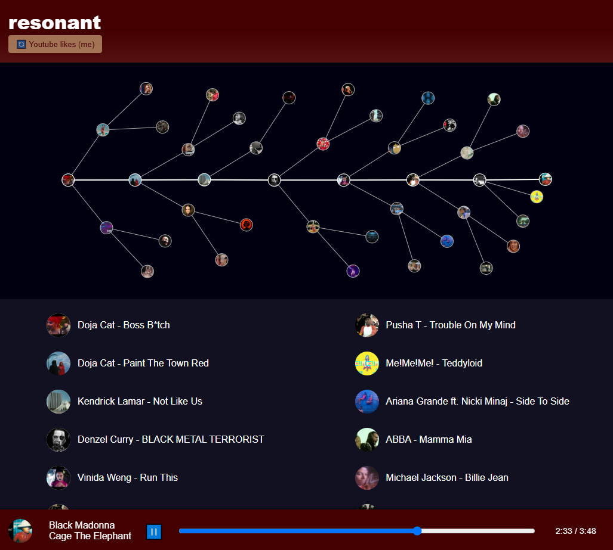

**resonant** is a tool for generating emotionally coherent playlists (/trees) by analyzing the affective properties of your music. It ingests songs (automatically pulled from your YouTube likes/history), tags and downloads them with metadata and cover art, and computes vector embeddings representing their affective feel. A webui uses this data to build playlists that help you explore your library and surface forgotten favorites:

This project started as a small script using the essentia ML models to find songs with similar vibes across playlists from people with different music tastes. Over time, it's been expanded into a more full application with a web interface, a public API, and a persistent music library. The idea is to treat musical taste not as a collection of genres or artists, but as a sort of graph structure that allows somewhat more freeform exploration.

### Usage

The app needs two files two function, neither of which are in this repo. One is the tf checkpoint of the discogs-effnet-bs4 model from essentia, which can be downloaded [here](https://essentia.upf.edu/models.html) and put in *program_files*. The other is a Google OAuth 2.0 client secrets file, which can be downloaded from the [Google Cloud Console](https://console.cloud.google.com/) and placed in the *user_files* directory. Note that the client code (namely *main-test.py* or *main-launch.py*) have to be edited to specify the filename of the client secrets file being used.

The webui can be launched with main-launch.py. As for the package itself, the app and internal model are exposed as a regular python package in the *resonant* directory - main-test.py shows an example of how to use it. Take note of the fact that `resonant.config` needs to be imported first to specify the system paths that the program will need during execution (data storage, user files, path to ffmpeg).

### Related tools

This tool exists specifically for the purpose of exploring affect similarity within a restricted library, but it bears mentioning that due to the high dimensionality of the embedding vectors (~1300d), the underlying models really shine in denser spaces - namely the space of all songs that exist, which can be explored via [cosine.club](cosine.club), [Music-Map](www.music-map.com), or other tools of this kind.

Spotify presumably uses similar techniques internally, but what's exposed to the user is fairly coarse. The platform surfaces a small number of affective metrics (valence, energy, danceability, etc.), but doesn’t offer much visibility into the structure of your own listening history. This project is partly a response to that gap.

### Structure

The project is fairly minimal at 1.7k LOC, so it's reasonable to give a submodule and class-level overview.

The **songmodel** submodule defines song objects, particularly drawing a distinction between `DownloadableSong` (a reference to some song stored online or elsewhere, with a `.download()` method that allows the program to ingest it) and a `KnownSong` (a song that is already in the repository). Another class, `DownloadableSongSource`, specifies a method by which to get an iteration of `DownloadableSong`s. Both of the `Downloadable` objects are meant as base classes.

The **sources** submodule defines concrete classes inheriting from `Downloadable`s - currently only one such pair that downloads songs from YouTube (via yt-dlp + ffmpeg). Note that instancing a `YoutubeDownloadableSongSource` requires specifying ( + giving the access token to ) a YouTube account and a specific playlist within that account - the intended usage would be to have several of these YouTube sources for different accounts. `YoutubeDownloadableSong` just implements the logic to download songs from YouTube, getting also their thumbnail as cover art and using some regex to attempt to extract the artist name.

The **songrepository** submodule handles persisting songs across execution, via a `SongDbInterface` that provides access to a SQL(alchemy) database. The db interface is not meant to be used directly but rather through the `SongRepository` class, which is a relatively thin wrapper that handles repo-level logic.

The **songaffect** submodule is responsible for computing a similarity score for songs - internally it does this via the extraction and comparison of affect-encoding vectors, but this isn't exposed by the submodule. `affect_vector_extraction.py` does what its name suggests, using tensorflow with the previously mentioned essentia models (+librosa and scipy to format the model input correctly), exposing at the submodule level an `extract_affect_vector` function. `AffectAnalyzer` uses this function to compute the affect vectors of any songs passed to it, and internally keeps a cache of previously computed affect vectors, which it persists through executions via HDF5 (h5py).

Two top-level module files are also relevant, *config.py* - mentioned before - and *graph.py*, which uses the repo and affect analyzer to draw up playlists / playtrees. This is all that's necessary to use *resonant* as a module - importing and setting the config, and the usage of `SongRepository` and `AffectAnalyzer` objects, possibly also a `MusicGraph` taking the prior two during init.

For webui usage, a further submodule is **backend**, which defines the application's state (namely, the three objects mentioned above, as well as a known mutable list of sources) and API (via FastAPI). The webui itself is contained in the top-level repo dir static, and it's a straightforward static html-css-js website - admittedly not one with great code, I do not do frontend often. The js uses d3js to render a (physics-simulated) graph of the current playtree. The website and backend can be launched with uvicorn (as a module rather than from the cli) with *main-launch.py*.